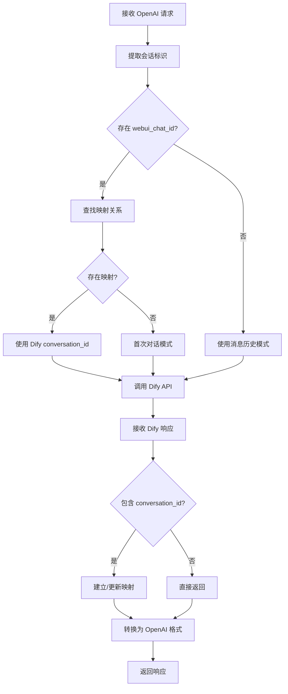
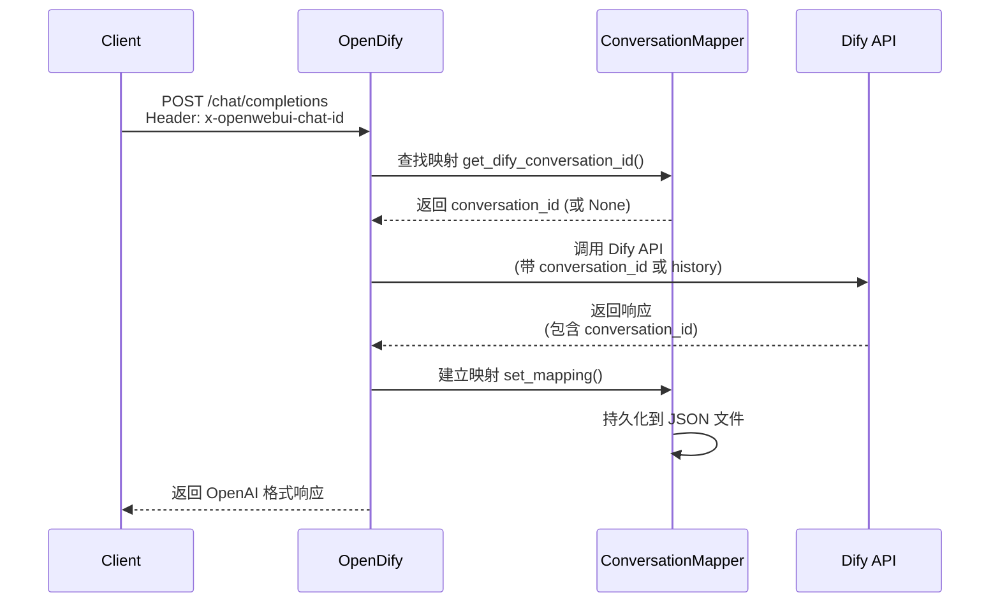

# OpenDify 状态管理机制

## 问题背景

OpenAI API 和 Dify API 在状态管理方面存在根本性差异：

| 特性 | OpenAI API | Dify API |
|------|------------|----------|
| 状态管理 | 无状态 | 有状态 |
| 会话标识 | 无 | `conversation_id` |
| 用户标识 | 可选 `user` 字段 | 必需 `user` 字段 |
| 历史消息 | 每次传完整 `messages` | 自动维护会话历史 |

## OpenDify 的解决方案

### 核心架构

OpenDify 通过**三层映射机制**无缝桥接两种API：

```
Open WebUI Client → OpenDify Proxy → Dify API
     ↓                    ↓              ↓
  chat_id         conversation_mapper  conversation_id
  user_id              ↓                user
  messages[]      state_transform      query + history
```

### 1. 会话标识映射

#### 自动检测机制
OpenDify 从多个来源提取会话标识：

**方法1: HTTP 头部提取** (主要方式)
```http
x-openwebui-chat-id: 92dd6958-0876-4f21-8fe9-f8b7ad52549c
x-openwebui-user-id: 85134a10-4168-4742-8924-88925c1761d2
```

支持的头部格式：
- `X-OpenWebUI-Chat-Id` (标准格式)
- `x-openwebui-chat-id` (小写格式) ✅
- `X-Openwebui-Chat-Id` (混合格式)

**方法2: 请求体 metadata**
```json
{
  "model": "claude-3-5-sonnet",
  "messages": [...],
  "metadata": {
    "chat_id": "92dd6958-0876-4f21-8fe9-f8b7ad52549c"
  }
}
```

**方法3: User-Agent 识别**
```http
User-Agent: aiohttp/3.8.0
```
识别来自 Open WebUI 后端的请求。

#### 映射存储机制

**ConversationMapper 类特性**：
- **持久化存储**: `data/conversation_mappings.json`
- **线程安全**: 使用锁机制保证并发安全
- **自动清理**: 支持清理过期映射

**映射数据结构**：
```json
{
  "92dd6958-0876-4f21-8fe9-f8b7ad52549c": {
    "dify_conversation_id": "conv_xxxxxx",
    "created_at": 1704603847,
    "last_used": 1704610123
  }
}
```

### 2. 用户标识处理

#### 用户ID转换
```python
"user": openai_request.get("user", "default_user")
```

**转换逻辑**：
- 存在 `user` 字段 → 直接使用
- 不存在 → 使用 `"default_user"`

#### 用户级会话管理
- Dify API 使用 `user` 字段进行用户级会话隔离
- 确保不同用户的对话不会相互干扰

### 3. 状态转换策略

#### 场景A: 有会话映射
```python
# 请求转换
dify_request = {
    "conversation_id": mapped_conversation_id,  # 使用映射ID
    "query": messages[-1]["content"],           # 最新消息
    "user": user_id,
    "response_mode": "streaming"
}
```

**优势**：
- 利用 Dify 原生会话管理
- 减少网络传输（无需传历史）
- 更好的性能表现

#### 场景B: 无会话映射
```python
# 请求转换 
dify_request = {
    "conversation_id": None,
    "query": messages[-1]["content"],
    "conversation_history": [                    # 传递历史消息
        {"role": "user", "content": "..."},
        {"role": "assistant", "content": "..."}
    ],
    "user": user_id,
    "response_mode": "streaming"
}
```

**适用场景**：
- 标准 OpenAI 客户端
- 首次对话
- 临时会话

### 4. 自动映射建立

#### 映射创建时机
```python
def update_conversation_mapping(webui_chat_id: str, dify_response: dict):
    dify_conversation_id = dify_response.get("conversation_id")
    if dify_conversation_id and not conversation_mapper.has_mapping(webui_chat_id):
        conversation_mapper.set_mapping(webui_chat_id, dify_conversation_id)
```

**触发条件**：
1. 收到 Dify 响应
2. 响应包含 `conversation_id`
3. 尚未建立映射关系

#### 映射维护
- **自动更新**: 更新最后使用时间
- **定期清理**: 清理超期映射（默认30天）
- **即时持久化**: 每次变更立即保存

## 完整工作流程

### 请求处理流程



### 状态同步机制



## 兼容性支持

### Open WebUI 完整支持
- ✅ 自动检测 `x-openwebui-chat-id`
- ✅ 支持 `x-openwebui-user-id`
- ✅ 维护会话连续性
- ✅ 多轮对话上下文保持

### 标准 OpenAI 客户端兼容
- ✅ 无状态请求支持
- ✅ 消息历史传递
- ✅ 流式响应支持
- ✅ 完整错误处理

### 混合场景支持
- ✅ 同时支持有状态和无状态客户端
- ✅ 动态适配不同请求类型
- ✅ 透明的状态管理切换

## 性能优化

### 连接复用
```python
HTTP_CLIENT_CONFIG = {
    "timeout": 30.0,
    "limits": httpx.Limits(
        max_keepalive_connections=20,
        max_connections=100
    ),
    "follow_redirects": True
}
```

### 缓存策略
- **映射缓存**: 内存中缓存活跃映射
- **连接池**: HTTP 连接复用
- **智能清理**: 定期清理过期数据

### 流式优化
- **动态延迟**: 根据缓冲区大小调整输出速度
- **智能缓冲**: 平滑的流式输出体验
- **实时处理**: 最小化响应延迟

## 监控和调试

### 调试日志
启用详细日志查看状态管理过程：
```python
logging.basicConfig(level=logging.DEBUG)
```

### 关键日志标识
```
🔍 Found chat_id in header: x-openwebui-chat-id
🔄 WebUI chat_id: 92dd6958... -> Dify conversation_id: conv_xxx...
🆕 New conversation mapping established
✅ Conversation mapping already exists
```

### 监控端点
```http
GET /v1/conversation/mappings     # 查看映射统计
POST /v1/conversation/cleanup     # 清理过期映射
```

### 故障排除

**常见问题**：
1. **映射未建立**: 检查头部格式和日志输出
2. **会话断连**: 验证映射文件权限和存储
3. **性能问题**: 检查连接池配置和清理策略

**调试命令**：
```bash
# 查看映射文件
cat data/conversation_mappings.json | jq .

# 测试头部检测
curl -H "x-openwebui-chat-id: test-id" http://localhost:5000/v1/chat/completions

# 查看详细日志
python main.py 2>&1 | grep "🔍\|🔄\|🆕"
```

## 最佳实践

### 客户端配置
1. **Open WebUI**: 确保发送 `x-openwebui-chat-id` 头部
2. **标准客户端**: 使用完整 `messages` 数组
3. **自定义客户端**: 可选择性发送 `user` 字段

### 服务端配置
1. **定期清理**: 配置映射清理策略
2. **监控存储**: 关注映射文件大小和增长
3. **日志管理**: 适当的日志级别和轮转

### 安全考虑
1. **会话隔离**: 依赖 `user` 字段进行用户隔离
2. **数据保护**: 映射文件包含会话标识信息
3. **权限控制**: 确保映射文件访问权限正确

## 总结

OpenDify 通过巧妙的三层映射机制，完美解决了 OpenAI API 无状态与 Dify API 有状态之间的矛盾：

- **透明性**: 对客户端完全透明，无需修改现有代码
- **高效性**: 充分利用 Dify 的状态管理能力
- **兼容性**: 同时支持有状态和无状态客户端
- **可靠性**: 持久化存储和自动恢复机制
- **可扩展**: 支持多种会话标识提取方式

这种设计使得 OpenDify 不仅是一个简单的 API 转换器，更是一个智能的状态管理代理，为用户提供了最佳的使用体验。