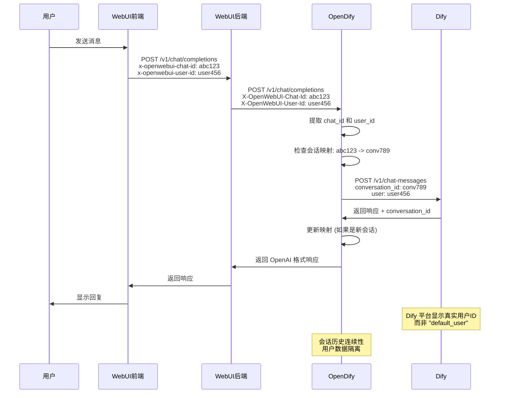

# OpenDify Chat ID 和 User ID 集成指南

## 📋 问题概述

在使用 Open WebUI + OpenDify + Dify 的多轮对话系统中，发现了两个关键问题：

1. **会话连续性问题**：每次对话都会创建新的会话，无法保持历史记录连续性
2. **用户标识问题**：Dify 平台显示所有用户都是 "default_user"，无法区分真实用户

经过深入分析，确定问题出在 WebUI 后端未正确转发前端发送的 `chat_id` 和 `user_id`。

## 🔍 问题分析

### 系统架构流程
```
用户对话 → Open WebUI 前端 → Open WebUI 后端 → OpenDify → Dify
         (发送 chat_id)    (应转发)      (接收处理)  (会话管理)
         (发送 user_id)    (应转发)      (用户识别)  (用户隔离)
```

### 问题症状

#### Chat ID 相关问题
- ✅ 前端正确发送 `x-openwebui-chat-id` 头部
- ✅ 请求正确到达 WebUI 后端 (通常端口 8080)
- ❌ WebUI 后端未正确转发 chat_id 到 OpenDify
- ❌ OpenDify 显示 "No chat_id found in request"
- ❌ 每次对话都创建新会话，丢失历史记录

#### User ID 相关问题
- ✅ 前端正确发送 `x-openwebui-user-id` 头部
- ✅ Open WebUI 识别不同用户并生成唯一的 user_id
- ❌ WebUI 后端未正确转发 user_id 到 OpenDify
- ❌ Dify 平台显示所有用户都是 "default_user"
- ❌ 无法区分不同用户的对话和数据分析

### 根本原因分析

通过分析 OpenDify 的日志输出可以看到：

```log
# Chat ID 问题
2025-07-30 12:00:57,243 - DEBUG - 🔍 Request from aiohttp (likely Open WebUI backend) but no chat_id header found
2025-07-30 12:00:57,243 - DEBUG - 🔍 No chat_id found in request

# User ID 问题  
2025-07-30 12:01:15,456 - DEBUG - 🔍 Searching for user_id in headers
2025-07-30 12:01:15,456 - DEBUG - 🔍 No user_id found in request headers
2025-07-30 12:01:15,456 - INFO - 👤 Using default user_id: default_user
```

这表明 WebUI 后端在转发请求时没有包含 `x-openwebui-chat-id` 和 `x-openwebui-user-id` 头部。

## ✅ OpenDify 端解决方案

OpenDify 已经实现了完整的 Chat ID 和 User ID 智能检测机制，无需用户手动修改任何配置。

### 1. Chat ID 检测机制

OpenDify 实现了多种方式的 chat_id 检测：

```python
def extract_webui_chat_id() -> Optional[str]:
    """从请求中提取 Open WebUI 的 chat_id"""
    # 方法1: 从 HTTP Header 提取 (支持多种大小写形式)
    possible_headers = ['X-OpenWebUI-Chat-Id', 'x-openwebui-chat-id', 'X-Openwebui-Chat-Id']
    
    for header_name in possible_headers:
        chat_id = request.headers.get(header_name)
        if chat_id:
            logger.debug(f"🔍 Found chat_id in header '{header_name}': {chat_id[:8]}...")
            return chat_id
    
    # 方法2: 直接遍历所有头部查找包含 chat-id 的
    for header_name, header_value in request.headers:
        if 'chat-id' in header_name.lower():
            logger.debug(f"🔍 Found chat_id in header '{header_name}': {header_value[:8]}...")
            return header_value
    
    # 方法3: 从请求体的 metadata 提取
    try:
        request_json = request.get_json() or {}
        metadata = request_json.get('metadata', {})
        chat_id = metadata.get('chat_id')
        if chat_id:
            logger.debug(f"🔍 Found chat_id in metadata: {chat_id[:8]}...")
            return chat_id
    except Exception:
        pass
    
    logger.debug("🔍 No chat_id found in request")
    return None
```

### 2. User ID 检测机制

OpenDify 实现了智能的用户ID提取，支持多种优先级来源：

```python
def extract_webui_user_id() -> Optional[str]:
    """从请求中提取 Open WebUI 的 user_id"""
    logger.debug("🔍 Searching for user_id in headers")
    
    # 支持多种头部格式
    possible_headers = ['X-OpenWebUI-User-Id', 'x-openwebui-user-id', 'X-Openwebui-User-Id']
    
    for header_name in possible_headers:
        user_id = request.headers.get(header_name)
        if user_id:
            logger.debug(f"🔍 Found user_id in header '{header_name}': {user_id[:8]}...")
            return user_id
    
    # 遍历所有头部查找用户相关头部
    for header_name, header_value in request.headers:
        if 'user-id' in header_name.lower():
            logger.debug(f"🔍 Found user-related header: '{header_name}' = '{header_value[:8]}...'")
            return header_value
    
    # 从请求体的 metadata 提取
    try:
        request_json = request.get_json() or {}
        metadata = request_json.get('metadata', {})
        user_id = metadata.get('user_id')
        if user_id:
            logger.debug(f"🔍 Found user_id in metadata: {user_id[:8]}...")
            return user_id
    except Exception:
        pass
    
    logger.debug("🔍 No user_id found in request headers")
    return None

# 用户ID优先级处理
user_id = (
    openai_request.get("user") or      # 1. OpenAI请求体中的user字段 (最高优先级)
    extract_webui_user_id() or         # 2. OpenWebUI头部中的user-id  
    "default_user"                     # 3. 默认值 (最低优先级)
)
```

### 3. 智能用户识别逻辑

OpenDify 通过多层检测确保准确识别用户：

**提取优先级**：
1. **OpenAI 标准 `user` 字段** - 兼容标准 OpenAI API 客户端
2. **Open WebUI 专用头部** - `x-openwebui-user-id`
3. **请求体 metadata** - 备用方案
4. **默认值** - `"default_user"` 作为最后保障

### 4. 会话映射管理

OpenDify 使用 `ConversationMapper` 类来管理 WebUI chat_id 到 Dify conversation_id 的映射：

```python
# 获取现有映射
dify_conversation_id = conversation_mapper.get_dify_conversation_id(webui_chat_id)

# 建立新映射（从 Dify 响应中提取）
def update_conversation_mapping(webui_chat_id: str, dify_response: dict):
    dify_conversation_id = dify_response.get("conversation_id")
    if dify_conversation_id and not conversation_mapper.has_mapping(webui_chat_id):
        conversation_mapper.set_mapping(webui_chat_id, dify_conversation_id)
```

### 5. 详细调试日志

OpenDify 提供了详细的调试日志来帮助排查 Chat ID 和 User ID 问题：

```python
# Chat ID 检测日志
logger.debug(f"🔍 All headers: {dict(request.headers)}")
logger.debug(f"🔍 Found chat_id in header 'x-openwebui-chat-id': {chat_id[:8]}...")
logger.info(f"🔗 Processing request for WebUI chat_id: {webui_chat_id[:8]}...")

# User ID 检测日志
logger.debug("🔍 Searching for user_id in headers")
logger.debug(f"🔍 Found user_id in header 'x-openwebui-user-id': {user_id[:8]}...")
logger.info(f"👤 User ID resolved: {user_id[:8]}...")
logger.info(f"👤 Processing request for WebUI user_id: {user_id[:8]}...")

# 会话映射日志
logger.info(f"🔄 WebUI chat_id: {webui_chat_id[:8]}... -> Dify conversation_id: {dify_conversation_id[:8] if dify_conversation_id else 'None'}...")
logger.info(f"🆕 New conversation mapping established: {webui_chat_id[:8]}... -> {dify_conversation_id[:8]}...")
```

## 🚨 Open WebUI 后端修复要求

**OpenDify 端已经做好了完整的接收和处理，问题出在 Open WebUI 后端的转发逻辑。**

需要在 Open WebUI 后端中确保转发 `x-openwebui-chat-id` 和 `x-openwebui-user-id` 头部到 OpenDify。

### 修复位置
文件: `backend/open_webui/routers/openai.py` (大约第825-850行)

### 完整修复代码示例
```python
# 获取 chat_id 和 user_id，支持多种来源
chat_id = request.headers.get("x-openwebui-chat-id") or (metadata.get("chat_id") if metadata else None)
user_id = request.headers.get("x-openwebui-user-id") or (metadata.get("user_id") if metadata else None)

headers = {
    "Content-Type": "application/json",
    # ... 其他头部
}

# 始终转发 chat_id，不受配置限制
if chat_id:
    headers["X-OpenWebUI-Chat-Id"] = chat_id
    log.debug(f"✅ Forwarding chat_id to OpenDify: {chat_id}")

# 始终转发 user_id，确保用户正确识别
if user_id:
    headers["X-OpenWebUI-User-Id"] = user_id
    log.debug(f"✅ Forwarding user_id to OpenDify: {user_id}")

# 备用方案：也可以在请求体中添加 user 字段
if user_id and "user" not in request_data:
    request_data["user"] = user_id
    log.debug(f"✅ Added user field to request body: {user_id}")
```

### 关键修复点

1. **Chat ID 转发**：确保 `x-openwebui-chat-id` 头部被正确转发
2. **User ID 转发**：确保 `x-openwebui-user-id` 头部被正确转发  
3. **备用方案**：可在请求体中添加 `user` 字段作为备用
4. **日志记录**：添加转发确认日志便于调试
5. **不受限制**：这两个头部应该始终转发，不受其他配置影响

## 🔧 调试方法

### 1. 检查前端发送
在浏览器开发者工具的网络面板中，确认请求包含：
```http
x-openwebui-chat-id: cbaa4045-49aa-4c49-9c2f-1f3cc1e6be53
x-openwebui-user-id: 85134a10-4168-4742-8924-88925c1761d2
```

### 2. 检查 OpenDify 接收
启用 OpenDify 调试日志：
```python
logging.basicConfig(level=logging.DEBUG)
```

查看日志输出：

#### Chat ID 检测日志
```log
# 成功情况
🔍 Found chat_id in header 'x-openwebui-chat-id': cbaa4045...
🔗 Processing request for WebUI chat_id: cbaa4045...
🔄 WebUI chat_id: cbaa4045... -> Dify conversation_id: conv_xxx...

# 失败情况  
🔍 No chat_id found in request
```

#### User ID 检测日志
```log
# 成功情况
🔍 Searching for user_id in headers
🔍 Found user_id in header 'x-openwebui-user-id': 85134a10...
👤 User ID resolved: 85134a10...
👤 Processing request for WebUI user_id: 85134a10...

# 失败情况
🔍 Searching for user_id in headers
🔍 No user_id found in request headers
👤 Using default user_id: default_user
```

### 3. 验证会话映射
访问 OpenDify 的调试端点：
```bash
curl http://127.0.0.1:5000/v1/conversation/mappings
```

返回示例：
```json
{
  "mapping_count": 5,
  "oldest_mapping": 1722123456,
  "newest_mapping": 1722987654,
  "timestamp": 1722987890
}
```

## 📁 会话数据持久化

OpenDify 自动将会话映射保存到 `data/conversation_mappings.json`：

```json
{
  "cbaa4045-49aa-4c49-9c2f-1f3cc1e6be53": {
    "dify_conversation_id": "91eff0d0-4d0e-4735-97c4-eb8cc4cd9784",
    "created_at": 1722123456,
    "last_used": 1722987654
  }
}
```

### 映射管理功能

```bash
# 查看映射统计
GET /v1/conversation/mappings

# 清理旧映射（默认30天）
POST /v1/conversation/cleanup
{"max_age_days": 30}
```

## 🎯 预期效果

修复完成后的完整流程：

### Chat ID 流程
1. **前端发送**: 包含 `x-openwebui-chat-id` 头部
2. **WebUI 后端转发**: 正确转发 chat_id 给 OpenDify
3. **OpenDify 处理**: 接收到 chat_id，建立会话映射
4. **Dify 处理**: 使用正确的 conversation_id 维护上下文
5. **用户体验**: 多轮对话保持历史记录连续性

### User ID 流程
1. **前端发送**: 包含 `x-openwebui-user-id` 头部
2. **WebUI 后端转发**: 正确转发 user_id 给 OpenDify
3. **OpenDify 处理**: 接收到 user_id，替换默认值
4. **Dify 处理**: 使用真实 user_id 进行用户级数据隔离
5. **管理体验**: Dify 平台显示真实用户ID，而非统一 "default_user"

### 综合效果
- ✅ **会话连续性**: 多轮对话保持完整历史记录
- ✅ **用户隔离**: 不同用户的对话数据完全隔离
- ✅ **数据分析**: Dify 平台可以准确分析真实用户行为
- ✅ **透明体验**: 用户无感知的智能处理

## 📊 技术架构图



## 💡 最佳实践

### Chat ID 管理
1. **始终转发**: chat_id 转发不应该受其他配置限制
2. **多重获取**: 支持从头部和请求体获取 chat_id
3. **持久化映射**: 自动保存会话映射到文件
4. **调试友好**: 提供详细的日志和调试端点
5. **错误处理**: 优雅处理映射失败的情况

### User ID 管理
1. **优先级清晰**: OpenAI user 字段 > WebUI 头部 > 默认值
2. **格式兼容**: 支持多种头部大小写格式
3. **数据隔离**: 确保不同用户数据完全隔离
4. **日志脱敏**: 用户ID在日志中部分遮掩显示
5. **备用方案**: 多种提取方式确保可靠性

### 安全建议
1. **权限控制**: 确保映射文件访问权限正确
2. **数据保护**: 映射文件包含敏感用户和会话信息
3. **定期清理**: 定期清理过期的会话映射数据
4. **监控异常**: 关注用户ID提取失败的情况

## 🐛 常见问题

### Q: 为什么 Dify 平台还是显示 "default_user"？
A: 检查 Open WebUI 后端是否正确转发 `x-openwebui-user-id` 头部。启用 OpenDify 调试日志查看用户ID提取过程。

### Q: 为什么有时候映射会丢失？
A: 检查 `data/conversation_mappings.json` 文件权限，确保 OpenDify 有写入权限。

### Q: 如何清理过期的映射？
A: 使用 `/v1/conversation/cleanup` 端点或直接删除 JSON 文件中的过期条目。

### Q: 映射文件损坏怎么办？
A: 删除 `data/conversation_mappings.json` 文件，OpenDify 会自动重新创建。

### Q: 如何验证用户ID是否正确传递？
A: 查看 OpenDify 日志中的 `👤 User ID resolved` 和 `👤 Processing request for WebUI user_id` 信息。

### Q: 不同用户的对话会不会混淆？
A: 不会。OpenDify 通过真实用户ID确保 Dify 平台进行用户级数据隔离。

## 🔍 测试验证

### 手动测试命令
```bash
# 测试 Chat ID 检测
curl -H "x-openwebui-chat-id: test-chat-123" \
     -H "Content-Type: application/json" \
     -d '{"model":"claude-3-5-sonnet","messages":[{"role":"user","content":"hello"}]}' \
     http://localhost:5000/v1/chat/completions

# 测试 User ID 检测  
curl -H "x-openwebui-user-id: test-user-456" \
     -H "Content-Type: application/json" \
     -d '{"model":"claude-3-5-sonnet","messages":[{"role":"user","content":"hello"}]}' \
     http://localhost:5000/v1/chat/completions

# 测试完整头部
curl -H "x-openwebui-chat-id: test-chat-123" \
     -H "x-openwebui-user-id: test-user-456" \
     -H "Content-Type: application/json" \
     -d '{"model":"claude-3-5-sonnet","messages":[{"role":"user","content":"hello"}]}' \
     http://localhost:5000/v1/chat/completions
```

### 日志监控命令
```bash
# 监控用户ID和会话ID检测日志
python main.py 2>&1 | grep -E "🔍|🔄|🆕|👤"

# 查看会话映射文件
cat data/conversation_mappings.json | jq .

# 监控特定用户的请求
python main.py 2>&1 | grep "test-user-456"
```

---

**完整解决方案已就绪！解决了会话连续性和用户识别两大核心问题！** 🎉