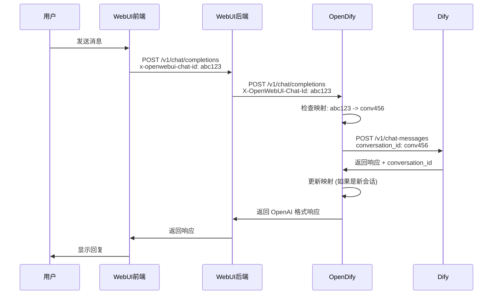

# OpenDify Chat ID 传递问题解决方案

## 📋 问题概述

在使用 Open WebUI + OpenDify + Dify 的多轮对话系统中，发现每次对话都会创建新的会话，无法保持历史记录连续性。经过深入分析，确定问题出在 WebUI 后端未正确转发前端发送的 `chat_id`。

## 🔍 问题分析

### 系统架构流程
```
用户对话 → Open WebUI 前端 → Open WebUI 后端 → OpenDify → Dify
         (发送 chat_id)    (应转发)      (接收处理)  (会话管理)
```

### 问题症状
- ✅ 前端正确发送 `x-openwebui-chat-id` 头部
- ✅ 请求正确到达 WebUI 后端 (通常端口 8080)
- ❌ WebUI 后端未正确转发 chat_id 到 OpenDify
- ❌ OpenDify 显示 "No chat_id found in request"
- ❌ 每次对话都创建新会话，丢失历史记录

### 根本原因分析

通过分析 OpenDify 的日志输出可以看到：

```log
2025-07-30 12:00:57,243 - DEBUG - 🔍 Request from aiohttp (likely Open WebUI backend) but no chat_id header found
2025-07-30 12:00:57,243 - DEBUG - 🔍 No chat_id found in request
```

这表明 WebUI 后端在转发请求时没有包含 `x-openwebui-chat-id` 头部。

## ✅ OpenDify 端解决方案

### 1. 增强头部检测

OpenDify 已经实现了多种方式的 chat_id 检测：

```python
def extract_webui_chat_id() -> Optional[str]:
    """从请求中提取 Open WebUI 的 chat_id"""
    # 方法1: 从 HTTP Header 提取 (支持多种大小写形式)
    possible_headers = ['X-OpenWebUI-Chat-Id', 'x-openwebui-chat-id', 'X-Openwebui-Chat-Id']
    
    for header_name in possible_headers:
        chat_id = request.headers.get(header_name)
        if chat_id:
            return chat_id
    
    # 方法2: 直接遍历所有头部查找包含 chat-id 的
    for header_name, header_value in request.headers:
        if 'chat-id' in header_name.lower():
            return header_value
    
    # 方法3: 从请求体的 metadata 提取
    try:
        request_json = request.get_json() or {}
        metadata = request_json.get('metadata', {})
        chat_id = metadata.get('chat_id')
        if chat_id:
            return chat_id
    except Exception:
        pass
    
    return None
```

### 2. 会话映射管理

OpenDify 使用 `ConversationMapper` 类来管理 WebUI chat_id 到 Dify conversation_id 的映射：

```python
# 获取现有映射
dify_conversation_id = conversation_mapper.get_dify_conversation_id(webui_chat_id)

# 建立新映射（从 Dify 响应中提取）
def update_conversation_mapping(webui_chat_id: str, dify_response: dict):
    dify_conversation_id = dify_response.get("conversation_id")
    if dify_conversation_id and not conversation_mapper.has_mapping(webui_chat_id):
        conversation_mapper.set_mapping(webui_chat_id, dify_conversation_id)
```

### 3. 调试日志

OpenDify 提供了详细的调试日志来帮助排查问题：

```python
# 请求头检测
logger.debug(f"🔍 All headers: {dict(request.headers)}")

# 映射状态
logger.info(f"🔄 WebUI chat_id: {webui_chat_id[:8]}... -> Dify conversation_id: {dify_conversation_id[:8] if dify_conversation_id else 'None'}...")
```

## 🚨 Open WebUI 后端修复要求

**OpenDify 端已经做好了接收和处理，问题出在 Open WebUI 后端的转发逻辑。**

需要在 Open WebUI 后端中确保转发 `x-openwebui-chat-id` 头部到 OpenDify：

### 修复位置
文件: `backend/open_webui/routers/openai.py` (大约第825-850行)

### 修复代码示例
```python
# 获取 chat_id，优先从请求头，其次从 metadata  
chat_id = request.headers.get("x-openwebui-chat-id") or (metadata.get("chat_id") if metadata else None)

headers = {
    "Content-Type": "application/json",
    # ... 其他头部
}

# 始终转发 chat_id，不受配置限制
if chat_id:
    headers["X-OpenWebUI-Chat-Id"] = chat_id
    log.debug(f"✅ Forwarding chat_id to OpenDify: {chat_id}")
```

## 🔧 调试方法

### 1. 检查前端发送
在浏览器开发者工具的网络面板中，确认请求包含：
```
x-openwebui-chat-id: cbaa4045-49aa-4c49-9c2f-1f3cc1e6be53
```

### 2. 检查 OpenDify 接收
启用 OpenDify 调试日志：
```python
logging.basicConfig(level=logging.DEBUG)
```

查看日志输出：
```log
# 成功情况
🔍 Found chat_id in header 'x-openwebui-chat-id': cbaa4045...
🔗 Processing request for WebUI chat_id: cbaa4045...

# 失败情况  
🔍 No chat_id found in request
```

### 3. 验证会话映射
访问 OpenDify 的调试端点：
```bash
curl http://127.0.0.1:5000/v1/conversation/mappings
```

返回示例：
```json
{
  "mapping_count": 5,
  "oldest_mapping": 1722123456,
  "newest_mapping": 1722987654,
  "timestamp": 1722987890
}
```

## 📁 会话数据持久化

OpenDify 自动将会话映射保存到 `data/conversation_mappings.json`：

```json
{
  "cbaa4045-49aa-4c49-9c2f-1f3cc1e6be53": {
    "dify_conversation_id": "91eff0d0-4d0e-4735-97c4-eb8cc4cd9784",
    "created_at": 1722123456,
    "last_used": 1722987654
  }
}
```

### 映射管理功能

```bash
# 查看映射统计
GET /v1/conversation/mappings

# 清理旧映射（默认30天）
POST /v1/conversation/cleanup
{"max_age_days": 30}
```

## 🎯 预期效果

修复完成后的完整流程：

1. **前端发送**: 包含 `X-OpenWebUI-Chat-Id` 头部
2. **WebUI 后端转发**: 正确转发 chat_id 给 OpenDify
3. **OpenDify 处理**: 接收到 chat_id，建立会话映射
4. **Dify 处理**: 使用正确的 conversation_id 维护上下文
5. **用户体验**: 多轮对话保持历史记录连续性

## 📊 技术架构图



## 💡 最佳实践

1. **始终转发**: chat_id 转发不应该受其他配置限制
2. **多重获取**: 支持从头部和请求体获取 chat_id
3. **持久化映射**: 自动保存会话映射到文件
4. **调试友好**: 提供详细的日志和调试端点
5. **错误处理**: 优雅处理映射失败的情况

## 🐛 常见问题

### Q: 为什么有时候映射会丢失？
A: 检查 `data/conversation_mappings.json` 文件权限，确保 OpenDify 有写入权限。

### Q: 如何清理过期的映射？
A: 使用 `/v1/conversation/cleanup` 端点或直接删除 JSON 文件中的过期条目。

### Q: 映射文件损坏怎么办？
A: 删除 `data/conversation_mappings.json` 文件，OpenDify 会自动重新创建。

---

**修复简单高效，解决了困扰已久的多轮对话历史记录问题！** 🎉